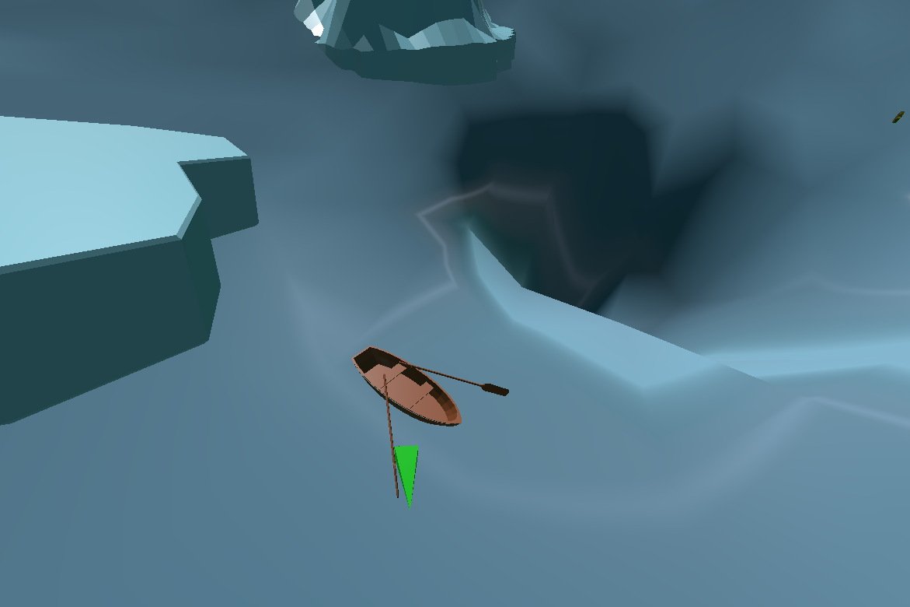
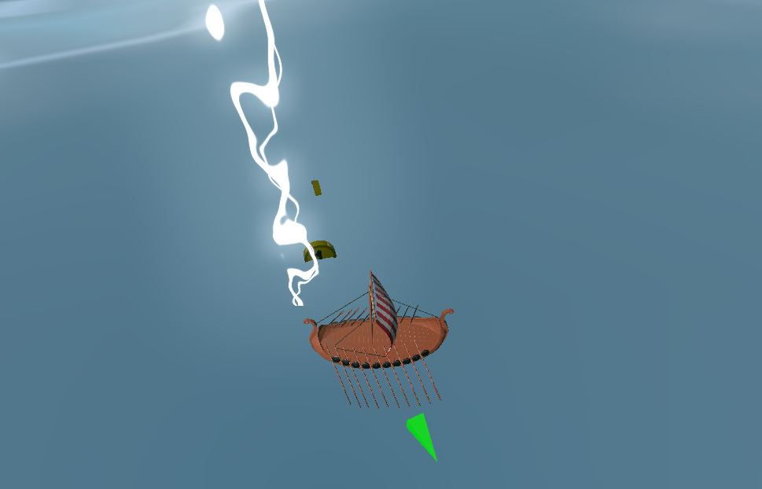

# An Odyssey Through Time

A game created for the MV Christmas Gamejam 2022.

You are aboard a small Viking longship, caught in a fierce storm at sea.
As you struggle to navigate through the raging thunderstorm, you notice maelstroms forming on the water’s surface, threatening to drag you to the ocean floor.
The storm intensifies, and a lightning bolt strikes the ship's main mast. Suddenly, you find yourself aboard a different vessel in another era, still in these treacherous waters, having been pulled through a time vortex.

Can you reach the safety of the island this time before another storm arises?

## Screenshots

